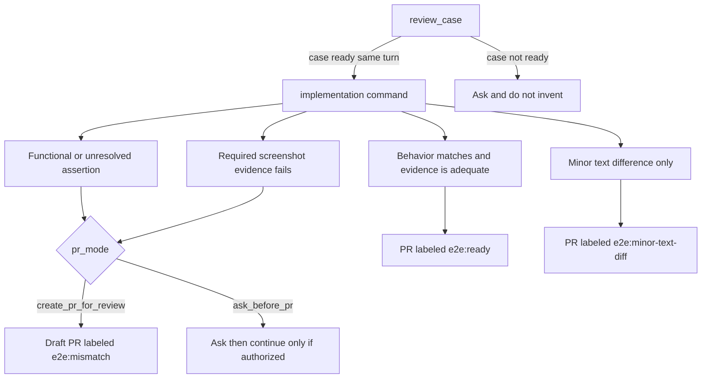

# Install

Add e2e-qa-pilot to **your own Playwright project**.

> ℹ️ **Note:** Just want to see it work first? The [Cabana example](https://github.com/bogdanOwner/e2e-qa-pilot/blob/main/examples/boutique-cabin/README.md#quick-start) runs on a demo site in this repository, with no project of your own. This page is for your project.

## Before you start

- **A GitHub account, signed in through the [`gh` CLI](https://cli.github.com/)** (`gh auth login`). Each run ends in a pull request, and the assistant uses `gh` to open it and add the label. Without it, you still get the spec and screenshots locally, but no pull request.
- Node.js 22 or later
- A git repository with Playwright already set up. Install Playwright's browsers yourself: e2e-qa-pilot never installs them.
- Cursor or Claude Code

**Optional**, only if you use them. See [Optional integrations](#optional-integrations).

- **Ticket in the branch name** (Jira, Plane, Linear): when every change needs a ticket. You create the ticket, and the assistant asks for its id and puts it in the branch and commit. No MCP needed
- **Case-tool MCP** (Qase, TestRail, Xray): to send a case id
- **Figma access**: to compare with designs
- **Feature-flag MCP** (GrowthBook, LaunchDarkly): to check flags in the environment you name, for example `staging`
- **Frontend repository** (read only, through `gh`): to find routes, test ids, labels, and flag keys, and to read the frontend pull request linked to a case
- **Several environments** (dev, stg): the run tests the environment your `test_command` and Playwright config point at. Set it there

## Quick start

Two ways, same result:

- **Option 1** if you want to run and control every step yourself.
- **Option 2** if you want your agent to do it. It is the easiest way.

### Option 1: Set it up step by step

1. **Install.** In your project root, run:

   ```bash
   npx e2e-qa-pilot init
   ```

   It detects Cursor or Claude Code and sets up the editor you use. See [`init` options](#init-options).

2. **Restart the editor and open a new chat.** A chat that was already open does not have the e2e-qa-pilot tools.

3. **Adapt it to your project.** In the new chat, send:

   ```text
   Set up e2e-qa-pilot for this project.
   ```

   The assistant reads your repository, asks only what it cannot find, and shows you `.e2e-qa-pilot/project.md` before it writes it. See [Project file](project.md).

4. **Commit the setup files.** Each run creates a branch for its test, and it does not start while the setup files are uncommitted. Commit them on their own branch, not on a feature branch. Do not commit `.cursor/mcp.json` or `.mcp.json` if they hold a credential or are gitignored. See [What `init` writes](#what-init-writes).

5. **Run your first test case.** Paste a case, as in [Send a case](#send-a-case). A pasted case needs no case tool.

### Option 2: Let your agent set it up

The easiest way. Open your project in Cursor or Claude Code and paste the prompt below. The agent:

- checks your project and uses the recommended defaults
- for a [complex setup](project.md#for-a-more-complex-setup-start-from-an-example) (a ticket id and a case id in the branch name, feature flags, or a frontend repository), drafts `project.md` from the closest example project file
- asks only what it cannot find, at most 3 short questions
- waits for your OK before it changes anything

<details open>
<summary><strong>Setup prompt</strong></summary>

```text
Set up e2e-qa-pilot in this project: https://github.com/bogdanOwner/e2e-qa-pilot
Use the latest npm release (npx e2e-qa-pilot@latest init).

Read first:
- Install steps: https://github.com/bogdanOwner/e2e-qa-pilot/blob/main/docs/install.md
- Project file: https://github.com/bogdanOwner/e2e-qa-pilot/blob/main/docs/project.md
- Example project files, for a complex setup only:
  - Jira key in the branch, Xray, LaunchDarkly, no Figma:
    https://github.com/bogdanOwner/e2e-qa-pilot/blob/main/examples/project-files/jira-xray-launchdarkly.md
  - Plane number in the branch, Qase, Figma per case, GrowthBook, frontend repository:
    https://github.com/bogdanOwner/e2e-qa-pilot/blob/main/examples/project-files/plane-qase-growthbook.md
  These files only show how each section is used. Keep only what this project
  really uses. Do not copy a tool, name, or value that it does not have.

How to work with me:
- Find answers yourself first: package.json, Playwright config, git remote,
  `gh auth status`, MCP config, CI files.
- When there is a choice, use the recommended option or default from the docs
  and tell me which one you picked. Don't ask about anything that has a default.
- Ask only what you cannot find or decide. Ask once, at most 3 short questions,
  each with your suggested answer, so I can reply "yes".
- If something blocks the setup (no Playwright, Node older than 22, no git repo),
  stop and tell me in one line how to fix it.

Step 1. Check. Show ✅ or ❌ for each requirement. Then name what this project
uses: ticket tracker, case tool, Figma, feature flags, frontend repository.
For each tool, say whether it is connected as an MCP server or only found in code.
Say whether it is a complex setup: a ticket id and a case id in the branch
name, feature flags, or a frontend repository. If it is, name the closest
example project file. Say what you will do next. Wait for my OK.

Step 2. Install. Run init and show me what it wrote.
Complex setup only: draft .e2e-qa-pilot/project.md from the closest example
with this project's names. For a section the project does not use, keep the
heading with nothing under it. Fill ## Feature flags only when a flag MCP is
connected. Never write a password, token, or key in project.md, including
test-user passwords: name the env var or secret store the tests read instead.
Show me the draft and write it only after I say yes.
For any other project, leave project.md to the setup in Step 3.

Step 3. Hand over. Give me one line to send in a new chat after the restart.
If you drafted project.md in Step 2, the line is only:
Set up e2e-qa-pilot for this project.
Otherwise it starts with that sentence and names only the tools connected as
MCP servers. Use this pattern, and drop each part the project does not have:
Set up e2e-qa-pilot for this project. We use <tracker> keys like <KEY-123> in branch names, cases are in <case tool>, designs are in <Figma or none>, and flags are in <flag tool>.

At the end, give me a short result, not a report:
- What is set up, with ⭐ next to the recommended choices you made
- Tools found in code but not connected as an MCP server, and what connecting
  each one would add
- What I need to do, in order:
  1. Restart the editor and open a new chat.
  2. Send the setup line from Step 3.
  3. Review and commit the files in .e2e-qa-pilot/ and the editor files init
     wrote, on their own branch from the start branch, not on a feature branch.
     Do not commit MCP config that holds a credential or is gitignored.
  4. Send the first test case below.
- A first test case to paste, written from a real page or flow in this project,
  with a Title: line and 3 to 4 numbered steps. One action and one Expected:
  result per step, with no "or" and no "if". Prefer a flow that needs no new
  account or special test data. Start it with:
  Review this case with e2e-qa-pilot and implement it if it is ready:
```

</details>

> ℹ️ **Note:** After `init`, restart the editor. The setup finishes in a new chat, as in [step 3 of Option 1](#option-1-set-it-up-step-by-step).

## Send a case

**A pasted case** needs no case tool. Include a `Title:` line and an expected result for each step:

```text
Review this case with e2e-qa-pilot and implement it if it is ready:

Title: Book Chalet 4 at Cabana
Preconditions: the guest is on the Cabana page.
1. Set check-in to 4 Aug 2026 and check-out to 5 Aug 2026, then click Search.
   Expected: Chalet 4 is listed at 497 EUR.
2. Press Increase quantity on the 497 EUR rate, then click Reserve Now.
   Expected: the guest form opens on the confirm page.
3. Enter First Name "Ana", Last Name "Pop", and Email Address "ana.pop@example.com", accept the terms, and click Confirm Booking.
   Expected: the confirmation says "Your request was successfully sent." and a booking reference is shown.
```

**A case id** needs a connected case tool (for example Qase) and a `## Case tool` section in `project.md`. The setup step can fill that section in:

```text
Review case QA-123, then implement it with e2e-qa-pilot.
```

The first run asks once for any setting it still needs, such as `test_command` and `png_dir`. See [Settings](settings.md). If the case is ready, the assistant implements it in the same turn and opens a pull request. Details are in [mcp.md](../mcp.md#review_case).

## Reference

You do not need this to get started.

### What `init` writes

`init` adds these files to your repository. You review and commit them in step 4. `settings.md` and `project.md` are plain Markdown, and the assistant reads them on every run.

| File | Purpose |
|------|---------|
| `.e2e-qa-pilot/settings.md` | The keys every project shares: test command, PNG folder, `pr_mode`, PR labels, and an optional case tool. Created once, never overwritten |
| `.e2e-qa-pilot/project.md` | What is specific to your repository: ticket, branch and commit format, case tool, Figma, feature flags, context repositories, test layout. Created once, never overwritten. See [Project file](project.md) |
| `.e2e-qa-pilot/processes/create-e2e/` | The four commands, the shared rules, and a short README, as plain Markdown |
| `.cursor/skills/<name>/SKILL.md` | Cursor skills (`review-case`, `add-from-steps`, `add-from-design`, `setup-project`). Each is a short stub that points at the commands above |
| `.claude/skills/<name>/SKILL.md` | The same skills for Claude Code |
| `.cursor/rules/e2e-qa-pilot.mdc` | Cursor only. An always-applied rule that tells the assistant to read both project files first |
| `CLAUDE.md` | Claude Code only. A block between `<!-- e2e-qa-pilot:begin -->` and `<!-- e2e-qa-pilot:end -->` with the same instruction. The rest of the file is never touched |
| `.e2e-qa-pilot/manifest.json` | The package version, the editors set up, and a hash of each file the package wrote. `upgrade` reads it. It holds no secret |
| `.cursor/mcp.json` and `.mcp.json` | One `e2e-qa-pilot` entry. Other servers in the file are kept. Do not commit the file if it holds a credential or is gitignored |

Review the diff and commit it before a workflow that creates or switches a branch. While these files are untracked, the branch step stops and names them. It never stashes, resets, or deletes them. Reviewing a case does not need a clean tree.

Branch names come from the case title: `e2e/{title_slug}`, or `e2e/{case_id}-{title_slug}` for a case id. `{title_slug}` is the title in kebab-case. The pull-request base falls back to `main`. `## Branch & commit` in [`project.md`](project.md) can change all of these. Git access to `origin` is needed for a run that creates a branch.

### `init` options

- `npx e2e-qa-pilot init [path]` sets up the folder you are in, or the path you pass. You can also run `npm install -g e2e-qa-pilot` and then `e2e-qa-pilot init`.
- It looks for `.cursor/` and `.claude/`, sets up the one it finds, and sets up both when both are present or when neither is. To choose, pass `--integration cursor`, `--integration claude`, or `--integration all`.
- It is safe to run again. It adds what is missing and leaves existing files alone.

### Set up for your editor

The project files are shared. The editors differ only in where you add the MCP servers your project uses (a case tool, Figma, a flag tool). Credentials stay there, never in `settings.md` or `project.md`.

- **Cursor:** `.cursor/mcp.json`, or Cursor Settings, MCP. Reload the window and open a new chat.
- **Claude Code:** `.mcp.json` in the project root, or `claude mcp add`. Quit, start Claude Code again in this folder, and open a new chat. `/mcp` lists the connected servers.

### Optional integrations

`init` does not configure these. Add only what you use. [Project file](project.md) says where each one is named.

- **Ticket tracker** (Jira, Plane, Linear), only if your branch or commit names a ticket. Set it in `## Ticket` and `## Branch & commit`, for example `Branch: {ticket_id}[_{case_id}]_{title_slug}`. The assistant asks once for the id when it is required. It never invents one and never creates a ticket.
- **Case-tool MCP** (Qase, TestRail, Xray), only to send a case id. The update checklist was written against Qase and has not been verified against other case tools.
- **Figma access**, only for design comparison. That path can depend on a milestone screenshot helper in your project. This package does not provide one.
- **Feature-flag MCP** (GrowthBook, LaunchDarkly), only if the project checks flags while it reviews a case. It is read only. Without a flag MCP, leave `## Feature flags` empty. Flags are then not checked, so a case that fails because a flag is off still ends as `e2e:mismatch`.
- **Frontend repository**, read through `gh` and named in `## Context repos`. The assistant reads routes, test ids, labels, and flag keys there, and the frontend pull request linked to a case. It never writes to it. It finds flag keys there, but reading a flag's state still needs a flag MCP.

### Upgrade

```bash
npx e2e-qa-pilot@latest upgrade
```

`upgrade` brings the skills in your project to the version you run. A file you edited is kept, and the new version is written next to it as `<file>.new`. `settings.md`, `project.md`, and your MCP entries are never changed. Commit the result.

<details>
<summary><strong>Upgrade details: what changes, pinning, and repair</strong></summary>

The skills in your project are copies. `upgrade` uses `.e2e-qa-pilot/manifest.json` to compare them:

- A file you did not edit is replaced.
- A file you edited is kept. The new version is written next to it as `<file>.new`, so you can compare. `upgrade --force` replaces it.
- A file the package no longer ships is removed, unless you edited it. A new file is added.
- `settings.md`, `project.md`, and your MCP entries are never changed. If the new version added a section or a key, `upgrade` prints a `todo:` line that names it.

Every tool result says "run `npx e2e-qa-pilot upgrade`" when your project files come from another version than the running server.

**Pinning.** To pin the package, change `e2e-qa-pilot` in your MCP entry to `e2e-qa-pilot@<version>`, and run `upgrade` with that same version when you move it. Without a pin, `npx -y` uses whatever npm resolves or has cached.

**Repair.** `init --force` replaces a file only when it still has the exact `<!-- e2e-qa-pilot:managed -->` line, which **discards your edits to it**. It is the repair for a project installed before the manifest existed. In `CLAUDE.md` it replaces only the marked block. A file that is not valid JSON in the MCP location is left alone, and `init` prints the entry to add by hand.

The skills also work without the MCP entry. See [Without MCP](../mcp.md#without-mcp).

</details>

## How a run ends

`init` copies Markdown commands and editor stubs into a project. `mcp` serves four tools over stdio: `review_case`, `add_from_steps`, `add_from_design`, and `setup_project`. Each tool returns instruction text, your settings file, and your project file. The flowchart is the workflow those instructions ask the assistant to follow. The server does not read or enforce `pr_mode`, and it does not choose a label. The same diagram is in [Create e2e](../processes/create-e2e/README.md). Tool contracts are in [mcp.md](../mcp.md).


```mermaid
flowchart TD
  reviewNode[review_case]
  implNode[implementation command]
  readyNode[Behavior matches and evidence is adequate]
  minorNode[Minor text difference only]
  assertNode[Functional or unresolved assertion]
  shotNode[Required screenshot evidence fails]
  modeNode{pr_mode}
  readyPr["PR labeled e2e:ready"]
  minorPr["PR labeled e2e:minor-text-diff"]
  draftPr["Draft PR labeled e2e:mismatch"]
  askNode[Ask then continue only if authorized]
  reviewNode -->|case not ready| askClarify[Ask and do not invent]
  reviewNode -->|case ready same turn| implNode
  implNode --> readyNode
  implNode --> minorNode
  implNode --> assertNode
  implNode --> shotNode
  readyNode --> readyPr
  minorNode --> minorPr
  assertNode --> modeNode
  shotNode --> modeNode
  modeNode -->|create_pr_for_review| draftPr
  modeNode -->|ask_before_pr| askNode
```
